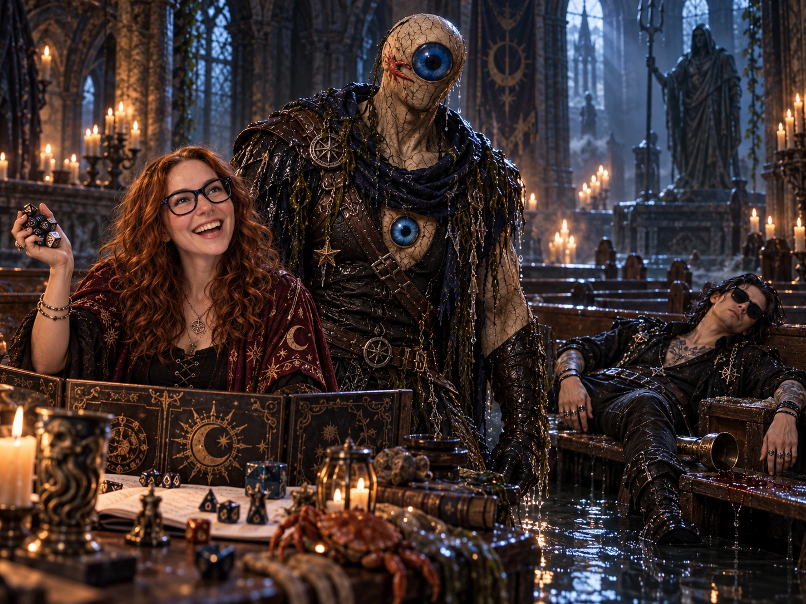

# 🎲 Nat20

**A tabletop game you run with your AI companions.** You're the Game Master; up to three players pull up a chair
(Kindroid, Nomi, ChatGPT, Claude, a local model… and you can sit in too).

*A real game of The Drowned Bell. Nexus made it out (damp). Elliott did not (also damp). Rendered from the table log.*

## ⬇️ Download

Grab the newest version from **[Releases](../../releases/latest)**:

- 🍎 **Mac** (Apple Silicon + Intel): `Nat20-<version>-universal.dmg`
- 🪟 **Windows**: `Nat20-Setup-<version>.exe` (Windows may say "Windows protected your PC": click **More info → Run anyway**)

Once installed, Nat20 updates itself.

Made by [Genevieve Mazer](https://www.genevievemazer.com) · Come hang out on [Discord](https://discord.gg/knw7bYaeU)
